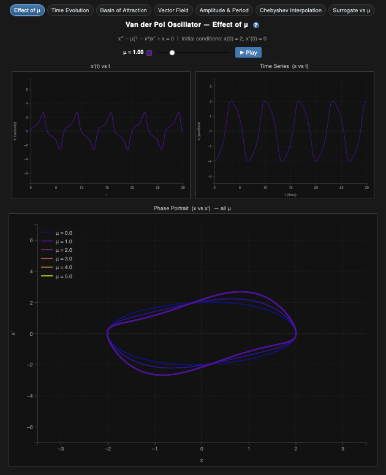
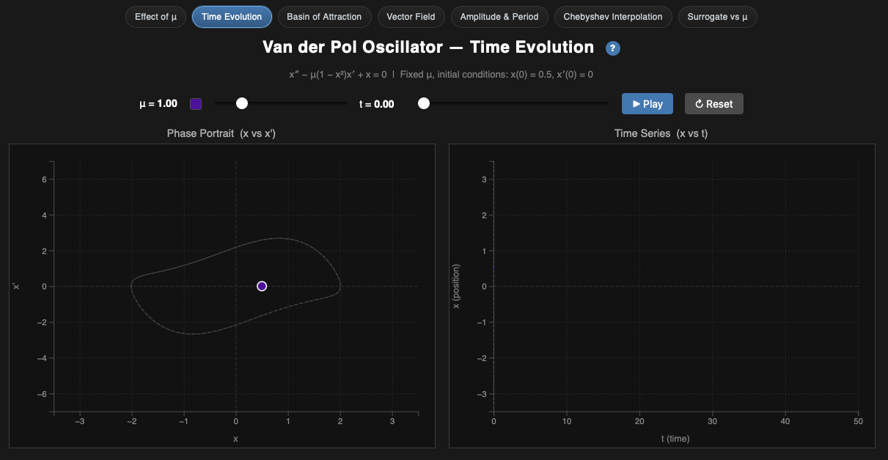
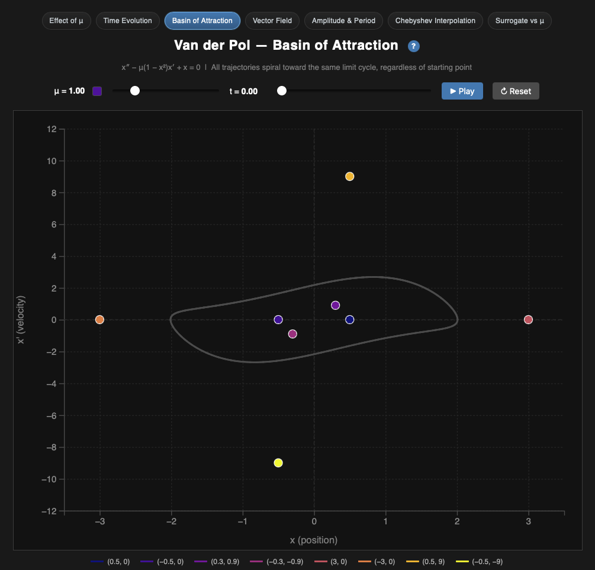
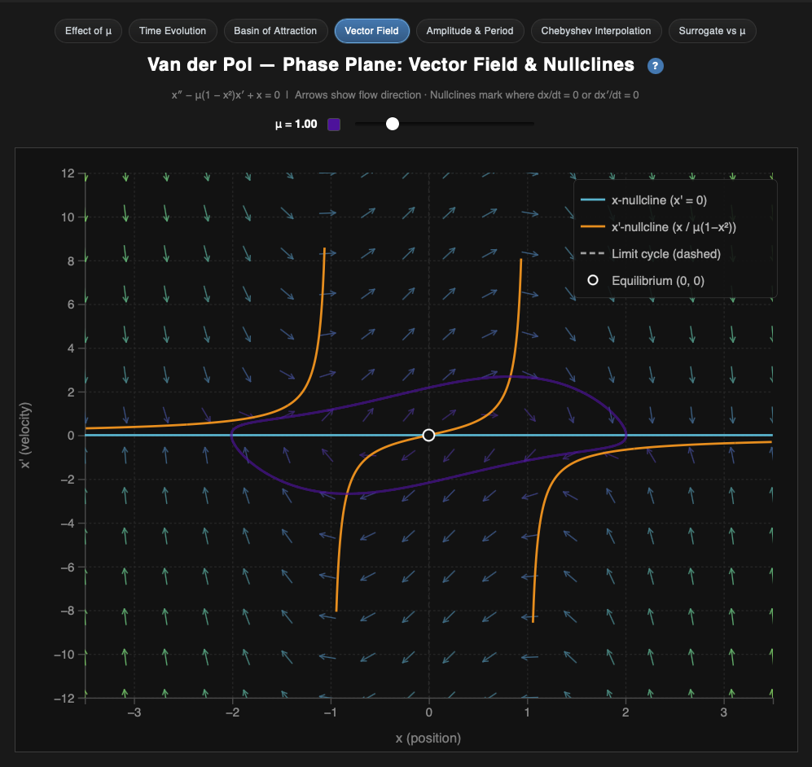
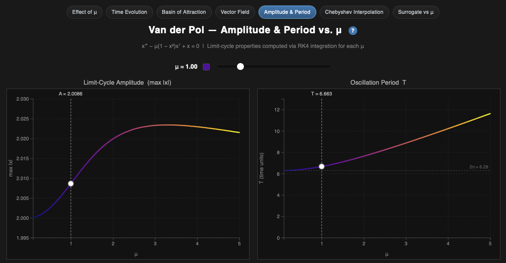
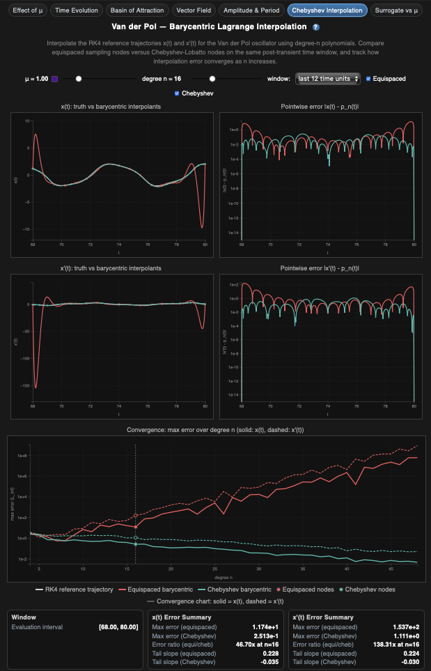
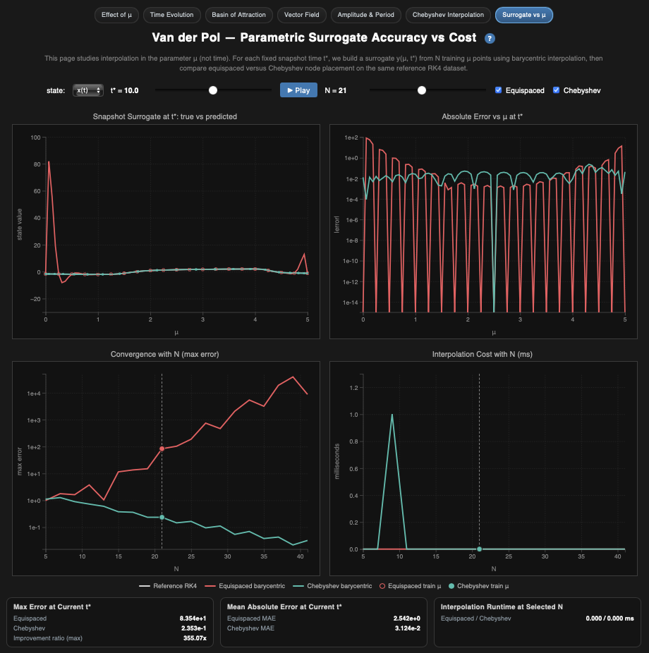

# Van der Pol Oscillator: Parametric Dynamics and Surrogate Modeling

**Name:** Gustavo Franco Reynoso

## How to Run

1. Open a terminal in the `Final` folder:
   ```bash
   cd /Users/gfranco/Documents/cis568/Final
   ```
2. Start a local web server:
   ```bash
   python3 -m http.server 8000
   ```
3. Open the project:
   - `http://localhost:8000/index.html`

Notes:
- This project loads D3 from CDN (`https://d3js.org/d3.v7.min.js`), so internet access is required.
- Use the navigation bar in each page to move across all seven idioms.

## Detailed Guide: How to Read the Visualizations and What They Mean

### 1) Effect of μ (`index.html`)
- Axes and encodings:
  `x'(t) vs t` panel uses time on x-axis and velocity on y-axis.
  `x(t) vs t` panel uses time on x-axis and position on y-axis.
  `x vs x'` panel uses position on x-axis and velocity on y-axis.
  Plasma color encodes `μ` (low `μ` darker, high `μ` brighter).
- How to read it:
  Start at low `μ` and move the slider upward slowly.
  Compare how smooth sinusoidal waves become sharper relaxation oscillations.
  In phase space, watch loops evolve from nearly elliptical to stiff rectangular-like cycles.
  Use the bottom panel to compare multiple `μ` limit cycles at once, not one-at-a-time.
- What it means:
  The same ODE changes qualitative behavior as one parameter changes.
  Increasing `μ` increases nonlinearity and separates slow and fast dynamics.
  That is what parametric sensitivity looks like in a nonlinear system.

### 2) Time Evolution (`page2.html`)
- Axes and encodings:
  Left panel (`x vs x'`) is phase space.
  Right panel (`x vs t`) is time-domain response.
  Colored curve = current trajectory, dashed curve = reference limit cycle, dot = current state.
- How to read it:
  Press play and track the dot in phase space and the growing time signal simultaneously.
  Pause at early, middle, and late time to inspect transient behavior.
  Change `μ` and rerun to compare how quickly trajectories approach steady oscillation.
- What it means:
  What you are watching is the transient dying out and the steady state taking over.
  The system "forgets" initial conditions as it approaches the attractor.
  Convergence speed depends on `μ`, which matters for stability and modeling timescales.

### 3) Basin of Attraction (`page3.html`)
- Axes and encodings:
  Single phase-plane chart with `x` on x-axis and `x'` on y-axis.
  Each color corresponds to one initial condition; hollow circles are starts; moving dots are current positions.
  Dashed curve is the limit cycle reference.
- How to read it:
  Focus on different starting radii (inside and outside the cycle).
  Run the animation and observe whether all trajectories approach the same closed orbit.
  Use the legend to track each initial condition path over time.
- What it means:
  Convergence from many distinct initial states indicates a global attractor.
  The long-term behavior does not depend on where you started.
  A system with this property is much easier to reason about and predict.

### 4) Vector Field + Nullclines (`page4.html`)
- Axes and encodings:
  Phase-plane chart with `x` (horizontal) and `x'` (vertical).
  Arrow direction gives local flow direction; arrow brightness gives speed.
  Cyan line is `x' = 0` nullcline.
  Orange curve is `dx'/dt = 0` nullcline.
  Dashed curve is the limit cycle; white point is equilibrium at origin.
- How to read it:
  First read arrows alone to understand local motion tendency.
  Then inspect where nullclines intersect: those are equilibrium candidates.
  Compare trajectory orientation near each nullcline to see sign changes in derivatives.
  Move `μ` and observe geometric deformation of nullclines and flow strength.
- What it means:
  It gives you a geometric understanding of why the system behaves the way it does, not just what a single trajectory looks like.
  Nullclines partition phase space into regions with different derivative signs.
  The structure explains why trajectories circulate and settle onto the cycle.

### 5) Amplitude & Period vs μ (`page5.html`)
- Axes and encodings:
  Amplitude chart: x-axis `μ`, y-axis `max |x|`.
  Period chart: x-axis `μ`, y-axis period `T`.
  Colored segments follow `μ`; cursor/dot show exact selected value.
  Dashed line at `2π` is harmonic reference.
- How to read it:
  Drag the μ slider and watch both charts update at the same x-position.
  Compare period values to the `2π` line at low `μ`.
  Examine how amplitude stays roughly bounded while period increases with `μ`.
- What it means:
  This converts visual oscillation shape into quantitative metrics.
  Low-`μ` behavior approximates linear oscillation period; high-`μ` behavior departs strongly.
  It also confirms that the solver is behaving correctly by matching the known linear period at low μ.

### 6) Barycentric Lagrange Interpolation (`page6.html`)
- Axes and encodings:
  `x(t)` and `x'(t)` panels: time on x-axis, state on y-axis.
  Error panels: time on x-axis, absolute error on log-scale y-axis.
  Convergence panel: degree `n` on x-axis, max error on log-scale y-axis.
  Gray = RK4 truth, red = equispaced interpolation, teal = Chebyshev interpolation.
- How to read it:
  Start with moderate `n`, compare interpolants against truth in both state panels.
  Move to error panels to see where interpolation fails most (often near boundaries).
  Increase `n` and monitor whether red/teal errors decay or oscillate.
  Use convergence panel slope to compare method quality across degrees.
- What it means:
  Interpolation is a real modeling decision, not just a plotting convenience.
  Node placement strongly affects stability and worst-case error.
  Chebyshev nodes typically reduce extreme error growth at higher degree.

### 7) Parametric Surrogate vs μ (`page7.html`)
- Axes and encodings:
  Snapshot panel: `μ` vs predicted/true state at fixed `t*`.
  Error panel: `μ` vs absolute surrogate error (log y-axis).
  Convergence panel: training size `N` vs max error (log y-axis).
  Cost panel: `N` vs runtime in milliseconds.
  Gray = RK4 truth, red = equispaced surrogate, teal = Chebyshev surrogate.
- How to read it:
  Pick state (`x` or `x'`) and time snapshot `t*`.
  Compare surrogate curves to truth across all `μ`.
  Check error profile to identify where each method struggles in parameter space.
  Increase `N` and compare improvement in error against runtime growth.
- What it means:
  This is where you actually decide which surrogate strategy to use for a parameter study.
  You can evaluate both accuracy and computational cost in one place.
  It helps you pick a node strategy that fits your actual accuracy and runtime budget.

## Why Each Visualization Matters (What / Why / How)

### 1) Effect of μ (`index.html`)
- **What:** Compares waveform and phase-portrait shape as `μ` changes.
- **Why:** Shows the regime transition from near-harmonic to relaxation oscillation, which is central to nonlinear dynamics.
- **How:** RK4 trajectories are computed for each `μ`, then linked views show velocity-time, position-time, and phase space simultaneously.

### 2) Time Evolution (`page2.html`)
- **What:** Shows how a single initial condition converges in time for a fixed `μ`.
- **Why:** Makes transient behavior explicit, which is necessary to study stability and settling dynamics.
- **How:** Animated integration draws the trajectory progressively in both phase space and time domain with synchronized controls.

### 3) Basin of Attraction (`page3.html`)
- **What:** Launches multiple trajectories from inside and outside the limit cycle.
- **Why:** Demonstrates global attraction behavior and robustness to initial condition choice.
- **How:** Eight initial conditions are integrated in parallel; all paths are overlaid to reveal convergence to the same attractor.

### 4) Vector Field + Nullclines (`page4.html`)
- **What:** Combines local flow vectors, nullclines, and limit cycle geometry in one phase-plane view.
- **Why:** Provides geometric intuition for fixed points, qualitative flow, and mechanism of oscillation.
- **How:** Vector field samples `f(x, x')`, nullclines are derived analytically, and the numerical limit cycle is overplotted.

### 5) Amplitude & Period vs μ (`page5.html`)
- **What:** Quantifies how limit-cycle amplitude and period depend on `μ`.
- **Why:** Converts qualitative phase behavior into measurable trends and validates expected asymptotics.
- **How:** For each `μ`, the solver runs post-transient; amplitude is computed as `max |x|` and period from successive zero crossings.

### 6) Barycentric Lagrange Interpolation (`page6.html`)
- **What:** Compares equispaced vs Chebyshev interpolation on `x(t)` and `x'(t)` with error diagnostics.
- **Why:** Evaluates numerical approximation quality and illustrates node-placement effects (including Runge-type behavior).
- **How:** RK4 truth is sampled, barycentric interpolants are built at degree `n`, then pointwise and convergence errors are plotted.

### 7) Parametric Surrogate vs μ (`page7.html`)
- **What:** Builds surrogates in parameter space `μ` at fixed snapshot time `t*`.
- **Why:** Directly addresses surrogate modeling tradeoffs between accuracy and computational cost for parameter studies.
- **How:** Training nodes in `μ` are selected (equispaced or Chebyshev), barycentric surrogates are evaluated on a dense μ grid, then error and runtime are reported vs `N`.

## Screenshots (All Pages)

### Effect of μ (`index.html`)


### Time Evolution (`page2.html`)


### Basin of Attraction (`page3.html`)


### Vector Field (`page4.html`)


### Amplitude & Period (`page5.html`)


### Chebyshev Interpolation (`page6.html`)


### Surrogate vs μ (`page7.html`)


## Hosted URL

- GitHub Pages: `https://gfranco008.github.io/cis568/Final/index.html`
- Local server URL: `http://localhost:8000/index.html`
